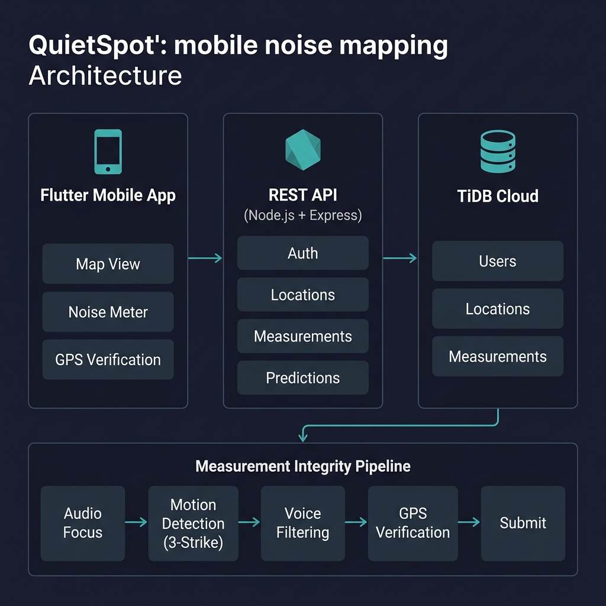

<p align="center">
  
</p>

<h3 align="center">Find quiet places. Backed by real data.</h3>

<p align="center">
  <a href="#features">Features</a> •
  <a href="#architecture">Architecture</a> •
  <a href="#data-trust-algorithm">Algorithm</a> •
  <a href="#measurement-integrity">Integrity Pipeline</a> •
  <a href="#tech-stack">Tech Stack</a> •
  <a href="#getting-started">Getting Started</a> •
  <a href="#api-reference">API</a> •
  <a href="#roadmap">Roadmap</a>
</p>

<p align="center">
  
  
  
  
  
</p>

---

## The Problem

Finding a quiet place to work, study, or just think shouldn't require trial and error. Noise levels at cafés, libraries, and co-working spaces change throughout the day — and no existing platform captures this data in a way that's **verifiable**, **temporal**, and **trustworthy**.

**QuietSpot** solves this by turning every smartphone into a calibrated noise sensor, building a crowdsourced map of urban noise levels with a rigorous data trust framework that tells you not just *how loud* a place is, but *how confident* you should be in that information.

---

## Features

| Feature | Description |
|---------|-------------|
| 🗺️ **Interactive Noise Map** | Color-coded markers (5 noise levels) with real-time data overlays on Mapbox GL |
| 📊 **Real-time dB Measurement** | 5-second sampling window with statistical averaging to eliminate transient spikes |
| 🧠 **4-Tier Prediction Algorithm** | Temporal pattern analysis with exponential decay weighting ([details below](#data-trust-algorithm)) |
| 🔒 **GPS-Verified Measurements** | Anti-spoofing: you can only measure where you physically are (50m radius verification) |
| 🎵 **Smart Audio Focus** | Auto-pauses background music, detects call interruptions, ensures clean measurement environment |
| 🤚 **3-Strike Motion Detection** | Accelerometer-based filtering to reject measurements contaminated by device movement |
| 🗣️ **Voice Anomaly Detection** | Distinguishes ambient conversation from shouting (>80dB + high variance = rejected) |
| ⭐ **Favorites & History** | Save and track noise patterns at your preferred locations |
| 🔗 **Navigation Integration** | Long-press any pin to open directions in Google Maps |

---

## Architecture

<p align="center">
  
</p>

```
┌─────────────────┐     HTTPS/REST      ┌──────────────────┐      TLS/MySQL      ┌───────────────┐
│  Flutter App     │ ◄──────────────────► │  Express API     │ ◄──────────────────► │  TiDB Cloud   │
│  (Android)       │                      │  (Node.js)       │                      │  (Distributed │
│                  │                      │                  │                      │   SQL)        │
│  • Map Screen    │                      │  • /locations    │                      │  • users      │
│  • Noise Meter   │                      │  • /measurements │                      │  • locations  │
│  • GPS Verify    │                      │  • /auth         │                      │  • noise_     │
│  • Predictions   │                      │  • /favorites    │                      │    measurements│
└─────────────────┘                      └──────────────────┘                      └───────────────┘
```

### Design Decisions

- **TiDB Cloud** over plain MySQL: Horizontally scalable, MySQL-compatible — ready for city-scale data without migration. Free tier for MVP.
- **Mapbox GL** over Google Maps: Better free tier, vector tiles, custom styling support. Loaded via `--dart-define` (no hardcoded tokens).
- **Prediction on both client & server**: Server computes predictions for the list view (batch), client re-computes for detailed spot view (freshness). Both use the same algorithm.
- **No JWT/session tokens (yet)**: Deliberate simplification for MVP. Auth state is stored client-side. The roadmap includes proper token-based auth.

---

## Data Trust Algorithm

The core innovation: not all noise data is equally trustworthy. QuietSpot uses a **4-tier hierarchical prediction system** that adapts its algorithm based on data density.

```
                    ┌─────────────────────────────────┐
                    │   Incoming Request for Spot X    │
                    └──────────────┬──────────────────┘
                                   │
                    ┌──────────────▼──────────────────┐
                    │  Latest measurement < 60 min?   │
                    └──────────────┬──────────────────┘
                          YES │           │ NO
                              ▼           ▼
                    ┌──────────────┐  ┌──────────────────┐
                    │  TIER 1      │  │ Count measurements│
                    │  Fresh Data  │  └────────┬─────────┘
                    │  Use as-is   │           │
                    └──────────────┘    ┌──────┴──────┐──────────┐
                                        │             │          │
                                   ≥40 meas.    20-39 meas.   <20 meas.
                                        │             │          │
                                        ▼             ▼          ▼
                                  ┌──────────┐ ┌──────────┐ ┌──────────┐
                                  │  TIER 2  │ │  TIER 3  │ │  TIER 4  │
                                  │ Confident│ │ Moderate │ │ Limited  │
                                  │ Predict. │ │ Predict. │ │  Data    │
                                  └──────────┘ └──────────┘ └──────────┘
```

### Tier Details

| Tier | Condition | Method | Confidence |
|------|-----------|--------|------------|
| **1 — Fresh** | Last measurement < 60 min | Use actual value | 🟢 Highest |
| **2 — Confident** | ≥ 40 measurements | Temporal filtering + exponential decay | 🔵 High |
| **3 — Moderate** | 20–39 measurements | Time-period filtering + recency weighting | 🟡 Medium |
| **4 — Limited** | < 20 measurements | Simple arithmetic average | 🟠 Low |

### Tier 2: Confident Prediction (the interesting one)

When we have 40+ data points, we apply **temporal pattern matching**:

1. **Time-of-day matching** — Only consider measurements within ±2 hours of current time
2. **Weekday vs. weekend** — Separate patterns (cafés behave differently on Saturdays)
3. **30-day recency window** — Discard data older than 30 days
4. **Exponential decay weighting** — `weight = e^(-days_ago / 10)`
5. **14-day boost** — Measurements from the last 2 weeks get 2× weight

This means a café that's quiet on weekday mornings but loud on Saturday nights will show **different predictions** depending on when you check.

---

## Measurement Integrity Pipeline

Every noise measurement passes through a multi-stage validation pipeline before it's accepted. This is designed with an **adversarial mindset** — assuming users might (intentionally or not) submit bad data.

```
┌──────────┐   ┌───────────────┐   ┌──────────────┐   ┌──────────────┐   ┌────────────┐
│  Audio   │──►│    Motion     │──►│    Voice     │──►│     GPS      │──►│   Submit   │
│  Focus   │   │  Detection    │   │  Filtering   │   │ Verification │   │  + Trust   │
│  Acquire │   │  (3-Strike)   │   │              │   │              │   │   Score    │
└──────────┘   └───────────────┘   └──────────────┘   └──────────────┘   └────────────┘
     │                │                   │                   │                │
  Pause BG         Strike 1-2:        >80dB +             Must be          Statistical
  music/audio      Warning +          high variance       within 50m       outlier
  Check for        vibrate +          = reject            of claimed       detection
  active call      restart timer                          location         via z-score
                   Strike 3:
                   Fail measurement
```

### Validation Parameters

| Parameter | Value | Rationale |
|-----------|-------|-----------|
| Reasonable dB range | 20–120 dB | Below 20 = sensor noise, above 120 = physical damage threshold |
| Outlier threshold | 2.5σ | Standard z-score cutoff for statistical outlier detection |
| Nearby radius | 100m | Cross-validate against neighboring spot measurements |
| GPS verification | 50m | Maximum distance from spot to accept a measurement |
| Measurement duration | 5 seconds | Long enough for stable average, short enough for user patience |
| User trust weighting | 70/30 | 70% current measurement quality, 30% user's historical accuracy |

---

## Tech Stack

| Layer | Technology | Why |
|-------|-----------|-----|
| **Mobile** | Flutter 3.x / Dart | Cross-platform ready, single codebase for Android (iOS planned) |
| **Backend** | Node.js + Express | Lightweight REST API, async I/O for concurrent measurement submissions |
| **Database** | TiDB Cloud (MySQL-compatible) | Distributed SQL — scales horizontally without changing queries |
| **Maps** | Mapbox GL via flutter_map | Vector tiles, custom styling, generous free tier |
| **Hosting** | Render | Auto-deploy from Git, free tier for MVP |
| **Sensors** | noise_meter, geolocator, sensors_plus | Hardware abstraction for microphone, GPS, accelerometer |

---

## Getting Started

### Prerequisites

- Android device (6.0+ / API 23+) or emulator
- Internet connection (for API + map tiles)

### Install from APK

1. Download `app-release.apk` from [`releases/`](releases/)
2. Enable "Install from unknown sources" on your device
3. Install and grant **Location** + **Microphone** permissions

### Build from Source

```bash
# Clone
git clone https://github.com/OrcBFF/quietspot1.git
cd quietspot1

# Backend
cd backend
cp .env.example .env   # Fill in your TiDB Cloud credentials
npm install
npm start

# Flutter app
cd ../quietspot
flutter pub get
flutter run --dart-define=MAPBOX_ACCESS_TOKEN=your_token_here \
            --dart-define=API_BASE_URL=http://10.0.2.2:3000  # for emulator
```

### Demo Account

```
Username: test
Password: test
```

---

## API Reference

Base URL: `https://quietspot-api.onrender.com/api`

| Method | Endpoint | Description |
|--------|----------|-------------|
| `GET` | `/locations` | List all spots with predicted noise levels |
| `GET` | `/locations/:id` | Get spot details + prediction |
| `POST` | `/locations` | Create new spot (with optional initial measurement) |
| `PUT` | `/locations/:id` | Update spot metadata |
| `DELETE` | `/locations/:id` | Delete spot |
| `POST` | `/measurements` | Submit a noise measurement |
| `GET` | `/measurements/location/:id` | Get measurement history for a spot |
| `GET` | `/measurements/nearby` | Get measurements within radius (lat/lng/radius) |
| `POST` | `/auth/signup` | Create account |
| `POST` | `/auth/login` | Authenticate |
| `POST` | `/auth/change-password` | Update password |
| `GET` | `/favorites/user/:id` | Get user's favorites |
| `POST` | `/favorites` | Add favorite |
| `DELETE` | `/favorites/:userId/:locationId` | Remove favorite |
| `GET` | `/health` | API health check |

> **Note**: The backend runs on Render's free tier and may take ~20s to wake from cold start on first request. A production deployment would use a paid tier or alternative hosting to eliminate this.

---

## Noise Level Classification

| Level | Range | Label | Color | Suitable For |
|-------|-------|-------|-------|-------------|
| 1 | < 40 dB | Very Quiet | 🟢 | Deep focus, reading, meditation |
| 2 | 40–54 dB | Quiet | 🟢 | Studying, remote work |
| 3 | 55–69 dB | Moderate | 🟡 | Casual work, meetings |
| 4 | 70–84 dB | Loud | 🟠 | Socializing (not for work) |
| 5 | ≥ 85 dB | Very Loud | 🔴 | Avoid for extended periods |

---

## Project Structure

```
quietspot1/
├── quietspot/                    # Flutter mobile application
│   └── lib/
│       ├── main.dart             # App entry point
│       ├── models/               # Data models (QuietSpot, NoiseLevel, etc.)
│       ├── services/             # Business logic layer
│       │   ├── api_service.dart              # REST API client
│       │   ├── prediction_service.dart       # 4-tier prediction algorithm
│       │   ├── measurement_validation_service.dart  # Integrity pipeline
│       │   ├── noise_measurement_service.dart # Microphone interface
│       │   ├── location_service.dart         # GPS services
│       │   └── poi_service.dart              # Point-of-interest matching
│       ├── screens/              # UI screens
│       │   ├── map_screen.dart               # Main map view (28KB — the big one)
│       │   ├── quick_add_spot_dialog.dart     # Measurement flow (26KB)
│       │   ├── spot_detail_screen.dart        # Spot details + history
│       │   └── ...                           # Auth, settings, favorites
│       └── managers/             # State management
├── backend/                      # Node.js REST API
│   ├── server.js                 # Express entry point
│   ├── db.js                     # TiDB Cloud connection pool
│   └── routes/                   # API endpoint handlers
│       ├── locations.js          # CRUD + prediction logic (server-side)
│       ├── measurements.js       # Measurement submission + validation
│       ├── auth.js               # Authentication endpoints
│       ├── favorites.js          # User favorites
│       └── users.js              # User management
├── databaseTiDB/                 # Database scripts
│   └── insert.sql                # Schema + seed data for demo
└── docs/
    └── images/                   # Architecture diagrams, banner
```

---

## Roadmap

### Near-term
- [ ] Password hashing (bcrypt) — currently plaintext for MVP
- [ ] JWT-based authentication with refresh tokens
- [ ] Rate limiting and input sanitization (helmet + express-rate-limit)
- [ ] Backend test suite (Jest)
- [ ] Flutter widget and unit tests
- [ ] CI/CD pipeline (GitHub Actions)
- [ ] Google Play Store deployment

### Medium-term
- [ ] Gamification v1 — streaks, badges, contributor leaderboards
- [ ] Offline mode with local caching and sync
- [ ] Push notifications for favorite spot noise changes
- [ ] Public REST API with API keys (SaaS foundation)
- [ ] OpenAPI/Swagger documentation
- [ ] iOS support

### Long-term Vision
- [ ] Noise data API for smart city applications
- [ ] Partnerships with municipalities for urban noise monitoring
- [ ] Integration with Google Maps / Apple Maps as a data layer
- [ ] Medical noise monitoring (hospital quiet zones, occupational health)
- [ ] ML-based prediction model (replacing heuristic tiers)

---

## Known Limitations

| Issue | Status | Mitigation |
|-------|--------|------------|
| Cold start delay (~20s) | Known | Render free tier limitation; production would use paid hosting |
| Device microphone variance | By design | Statistical averaging + cross-validation with nearby spots reduces impact |
| Plaintext passwords | MVP trade-off | Bcrypt migration planned before public launch |
| No offline support | Planned | Local caching with background sync on roadmap |
| Android only | Current | Flutter enables iOS with minimal changes |

---

## Author

**Nikolas Tsoukalas**
NTUA — School of Electrical and Computer Engineering

📧 el20901@mail.ntua.gr

---

## License

This project is proprietary software. All rights reserved.
Unauthorized copying, modification, or distribution is not permitted without explicit written consent.

---

<p align="center">
  <sub>Built with ☕ and a quest for silence</sub>
</p>
